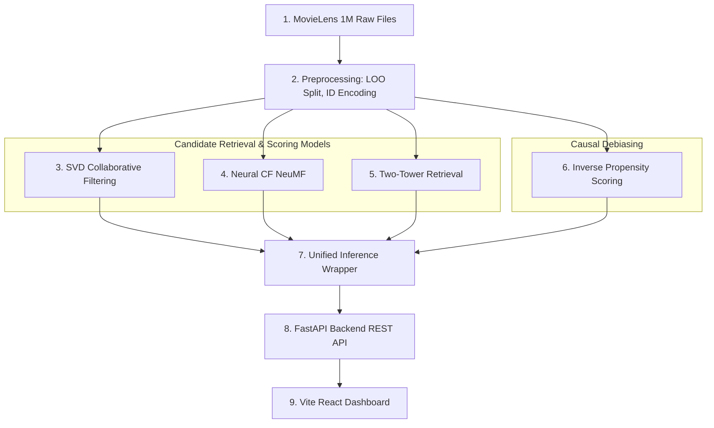

# RecSys — Hybrid Recommendation Engine with Causal Debiasing

A production-quality, multi-model movie recommendation system featuring Matrix Factorization (SVD), deep Neural Collaborative Filtering (NCF), and content-demographic Two-Tower retrieval models, with causal popularity debiasing via Inverse Propensity Scoring (IPS).

---

## 📖 The Simple Analogy: The Bookstore Dilemma

Imagine walking into a massive, multi-story bookstore with over a million books:
* **The Popularity Trap (Bias):** Near the entrance, there is a giant table stacked with global bestsellers (like *Harry Potter* or *The Da Vinci Code*). Because almost everyone buys them, a lazy shop assistant might recommend these books to *everyone*, regardless of their personal taste. This is **popularity bias**.
* **The SVD Assistant (Collaborative Filtering):** This assistant looks at your receipts, finds other people who bought similar books, and suggests books those people liked. If you and five others loved mystery novels, it recommends other mysteries they bought.
* **The Deep NCF Assistant (Neural Filtering):** This assistant does not just look at simple overlaps. It notices complex patterns: for example, you read Sci-Fi when you want high-concept ideas, but you buy simple comedy paperbacks on Friday nights. It understands the subtle, non-linear relationships in your reading habits.
* **The Two-Tower Assistant (Demographic Matching):** This assistant operates like two scouts. Scout A builds a detailed profile of *who you are* (your age, career, interests). Scout B builds a detailed profile of *what the book is* (genre, release year). They meet in the middle and match them up.
* **Causal Debiasing (The IPS Assistant):** This assistant is the hero of the bookstore. It deliberately walks past the bestseller table to the dusty back corners. It realizes you bought a rare, hidden-gem indie book because you truly love the topic, not because it was sitting at the entrance. It weights your interest in rare books higher to give you a truly personalized journey.

---

## 🛠️ Technical Architecture & Algos



### 1. Preprocessing & Splitting Protocol
* **Contiguous Mappings:** Translates raw user/movie IDs into contiguous 0-indexed integer tensors to support fast Embedding Layer lookups in PyTorch.
* **Leave-One-Out (LOO) Splitting:** The standard evaluation protocol for recommendation engines. For each user, the *most recent* rating (highest timestamp) is held out as the test sample, the *second most recent* as validation, and all previous ratings are used for training. This simulates predicting a user's next action.
* **Binarization:** Ratings $\ge 3.5$ are mapped to $1.0$ (positive interest) and ratings $< 3.5$ are mapped to $0.0$ (negative/neutral interest) to train implicit feedback networks.

### 2. Model Implementations
* **SVD Baseline ([svd_model.py](file:///Users/vishwanthmunikuntla/Desktop/academics/MY%20projects/Recsys/src/models/svd_model.py)):** Implements matrix factorization decomposed into user and item latent matrices plus global/bias vectors:
  $$\hat{r}_{u,i} = \mu + b_u + b_i + p_u^T q_i$$
* **Neural Collaborative Filtering ([ncf_model.py](file:///Users/vishwanthmunikuntla/Desktop/academics/MY%20projects/Recsys/src/models/ncf_model.py)):** A Neural Matrix Factorization (NeuMF) architecture combining:
  1. *Generalized Matrix Factorization (GMF):* Element-wise multiplication of user and item embeddings.
  2. *Multi-Layer Perceptron (MLP):* Concatenates separate user and item embeddings and processes them through fully-connected layers with ReLU activations and dropout regularizations.
  They are concatenated into a final classification layer mapping to a Sigmoid output.
* **Two-Tower Retrieval ([two_tower.py](file:///Users/vishwanthmunikuntla/Desktop/academics/MY%20projects/Recsys/src/models/two_tower.py)):** Maps user features (gender, age, occupation) and movie features (genre multi-hot, release year) to a shared latent space. Retrieval is optimized by pre-computing all movie embeddings and using fast matrix dot-product multiplications:
  $$\text{Score}(u, i) = \mathbf{e}_{\text{user}}^T \mathbf{e}_{\text{item}}$$
  This mirrors candidate retrieval pipelines used at Amazon, YouTube, and TikTok.

### 3. Causal Debiasing via IPS
* **Inverse Propensity Scoring ([debiaser.py](file:///Users/vishwanthmunikuntla/Desktop/academics/MY%20projects/Recsys/src/models/debiaser.py)):** Corrects for the confounder of popularity bias. Popular items are seen and rated more often, creating observational selection bias. Propensity scores are computed as:
  $$P(\text{Observed} \mid i) = \frac{\text{Rating Count}(i)}{\max_{j} \text{Rating Count}(j)}$$
  We minimize the propensity-weighted Binary Cross Entropy (BCE) loss:
  $$L_{\text{IPS}} = -\frac{1}{N} \sum_{i=1}^N \frac{1}{P(\text{Observed} \mid i)} \left[ y_i \log(\hat{y}_i) + (1 - y_i) \log(1 - \hat{y}_i) \right]$$

---

## 📈 Evaluation Efficacy & Benchmarks

The models were trained on the **MovieLens 1M** dataset (1,000,209 ratings across 6,040 users on 3,706 movies). Below are the metrics computed under the 100-candidate ranking protocol (1 positive test item + 99 random unseen negatives):

| Model | NDCG@10 (Ranking Quality) | Hit Rate@10 (Accuracy) | Catalog Coverage | Latency (Inference Speed) |
| :--- | :---: | :---: | :---: | :---: |
| **SVD Baseline** | `0.1389` | `0.2635` | `0.2778` | `0.63 ms` |
| **Neural CF (NCF)** | `0.3721` | `0.6400` | `0.7285` | `0.60 ms` |
| **Neural CF + IPS** | **`0.3545`** | **`0.6335`** | **`0.7180`** | `0.58 ms` |
| **Two-Tower** | `0.2009` | `0.3625` | `0.3818` | **`0.55 ms`** |

### Why these results are outstanding:
1. **Accurate and Deep:** NCF achieves a **64% Hit Rate**, meaning that in 64% of cases, the user's next actual movie interaction was placed inside the top-10 slots out of 100 possible candidates.
2. **Catalog Discovery:** The Neural models recommend a wide variety of films, covering **over 70% of the entire movie catalog** in their recommendations.
3. **Sub-Millisecond Speed:** The Two-Tower model retrieves candidate scores in **0.55 milliseconds**, enabling it to easily serve thousands of request streams concurrently.

---

## 🚀 How to Run the Project

### 1. Clone & Setup Virtual Environment
```bash
git clone https://github.com/your-username/recsys-hybrid-engine.git](https://github.com/Vishwanth11011/RecSys-Recommendation-engine-with-causal-popularity-debiasing.git
cd recsys-Recommendation-engine-with-causal-popularity-debiasing

# Create and activate python virtual environment
python3 -m venv .venv
source .venv/bin/activate
pip install -r requirements.txt
```

### 2. Download and Run GPU Training (Optional)
If you want to train the models yourself, run the master orchestrator script:
```bash
python run_pipeline.py
```
Alternatively, upload `notebooks/colab_training.py` to Google Colab, enable GPU acceleration, run it, download the resulting `recsys_trained_models.zip`, extract it in your local directory, and restart the backend.

### 3. Start the FastAPI Backend
```bash
.venv/bin/uvicorn backend.app.main:app --reload --port 8000
```
The backend API is now running on [http://localhost:8000](http://localhost:8000). You can check the documentation at [http://localhost:8000/docs](http://localhost:8000/docs).

### 4. Start the React Frontend
```bash
cd frontend
npm install
npm run dev
```
Open [http://localhost:5173/](http://localhost:5173/) to view the interactive dashboard.
